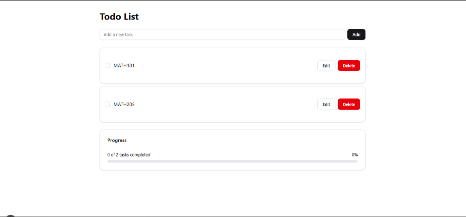
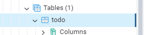
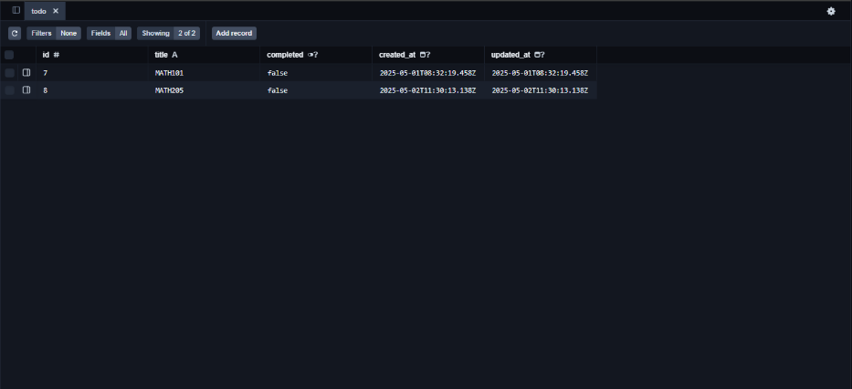
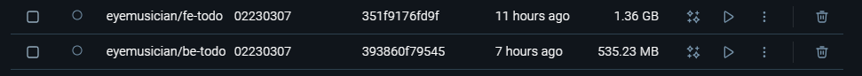

# Introduction

This assignment is divided into three major parts focusing on deploying a simple web application using Docker and Render.com. The app is a basic **To-do List** built using a full-stack architecture with database integration and continuous deployment configuration.

### Building a Simple To-do Application

**For the frontend part**: i have used next.js with shadcn adn designed a simple UI
**Backend**: Node.js with Express 
**Database**: PostgreSQL (connected using Prisma ORM)  
**Postgres tool** :  pgAdmin 

### Backend
- CRUD APIs for tasks
- Connected to PostgreSQL using Prisma ORM
- Environment variables set in `.env`


### Frontend
- User Interface for adding, editing, and deleting tasks




### Data-base

I created a todo table using pgAdmin, as shown in the image below, and successfully connected the PostgreSQL database to the backend using Prisma ORM.







### Part A: Building and Pushing Docker Images

#### Backend Docker Image

Dockerfile 
```
FROM node:18-alpine
WORKDIR /app
COPY package*.json ./
RUN npm install
COPY . .
EXPOSE 5000
CMD ["node", "server.js"]
```

Build and Push: 
```
docker build -t eyemusician/be-todo:02230307 .
docker push eyemusician/be-todo:02230307
```

### Frontend Docker Image

#### Dockerfile
```
FROM node:18-alpine
WORKDIR /app
COPY package*.json ./
RUN npm install
COPY . .
EXPOSE 3000
CMD ["npm", "start"]
```
#### Build and Push

```
docker build -t eyemusician/fe-todo:02230307 .
docker push eyemusician/fe-todo:02230307
```

output for above :



